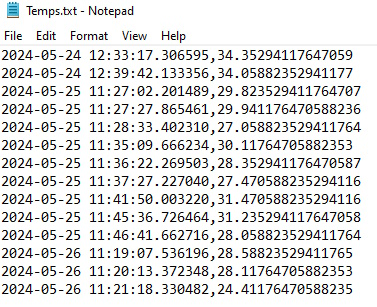
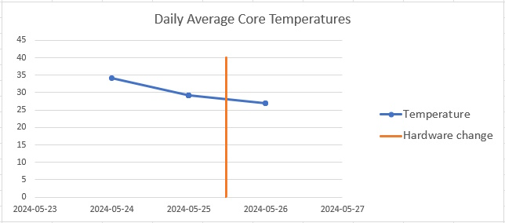

# What does it do and why
This program initializes the HWMonitor software to periodically monitor the CPU's temps. All the different temperatures from each core are average into a single value with its corresponding timestamp. The data is saved to a .txt file in the same folder as the script.

I created it because I wanted to measure the impact of applying thermal paste to my cpu.
# How to use
Run the main.py file. You'll need to have the python interpreter installed for it to work and you should also have HWMonitor.

The script will create a cache file with the location of the HWMonitor executable. If it cannot find it in its default location, a prompt will ask you to specify where it is located.

I'd recommend running this script from a command prompt that has been opened with admin privileges. If you don't, the program should ask you for them and run after you grant them, but it will be messier as a second python window will be opened.

The only argument you can pass to the script is '-v', which will make the command prompt window output information about the execution of the scripts while its running.

Since it uses keyboard and mouse automation, it's not recommended you use your PC while the software is running. Instead, you can use it a way to measure idle temps. The temperature is recorded once per minute while the script is running.

After the data has been gathered, I'd suggest you use a program like Excel to help you visualize the data.

# System
Tested on Windows 11. Should also work on Windows 10. Not sure about older versions of Windows. Will most likely not work on other OS. **The 'Save as' window detection as it's currently written depends on the theme applied to windows. It will only work with dark themed windows.**

The libraries used include subprocess, pyautogui, os, datetime, ctypes, sys.

HWMonitor version used was 1.48 (free).